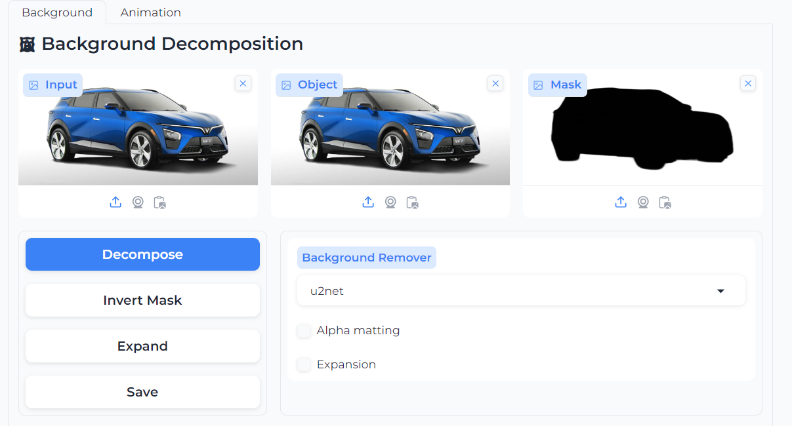
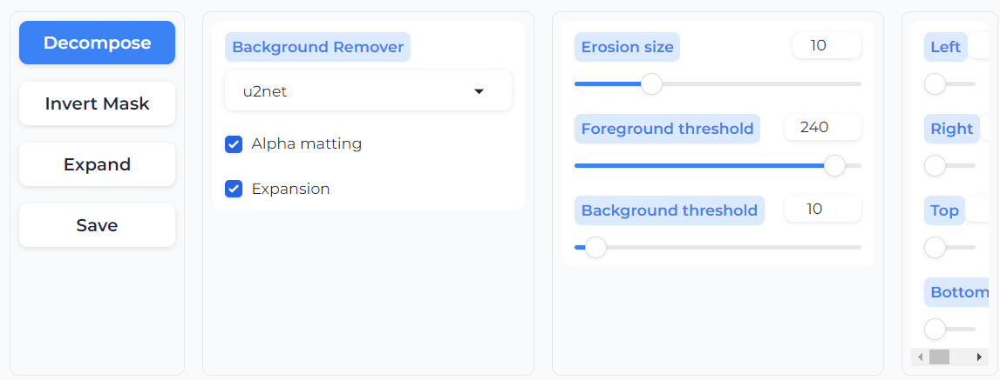
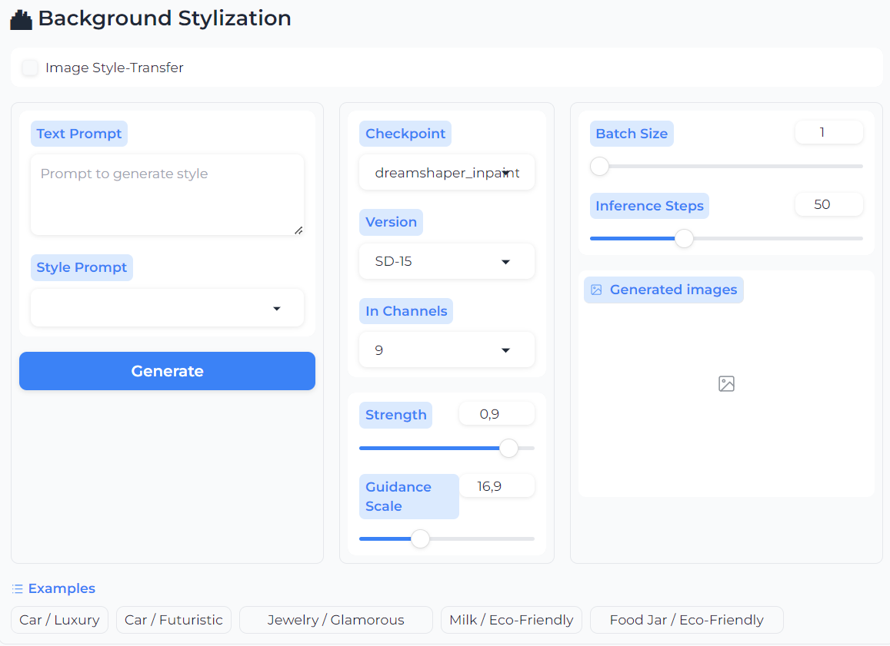
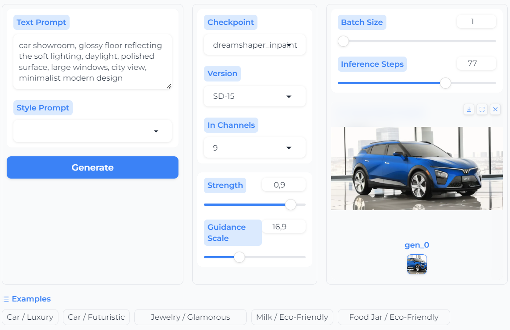
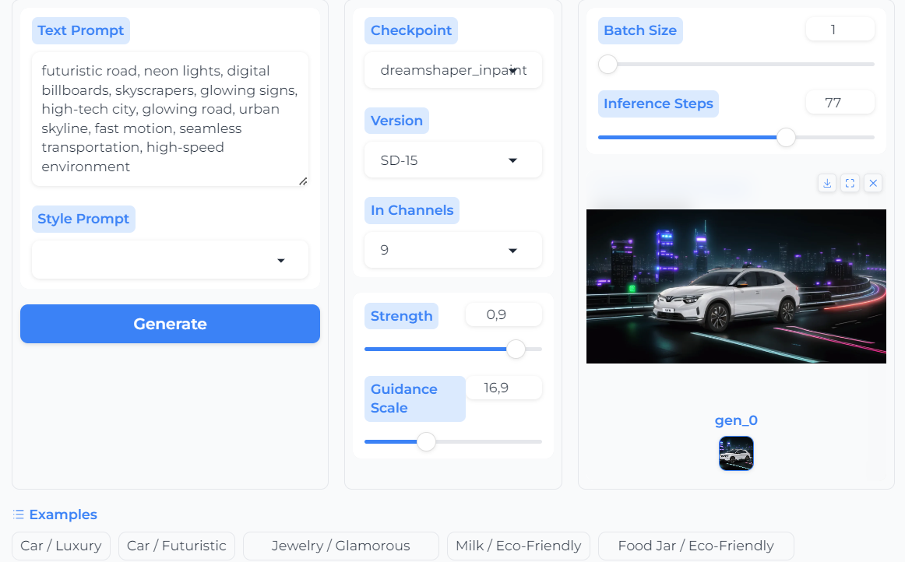
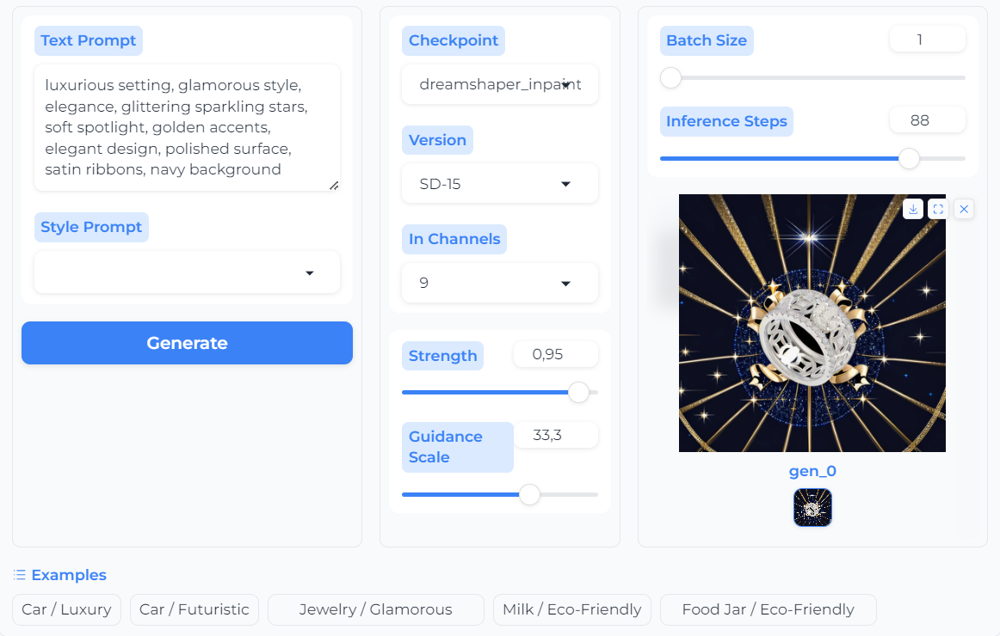
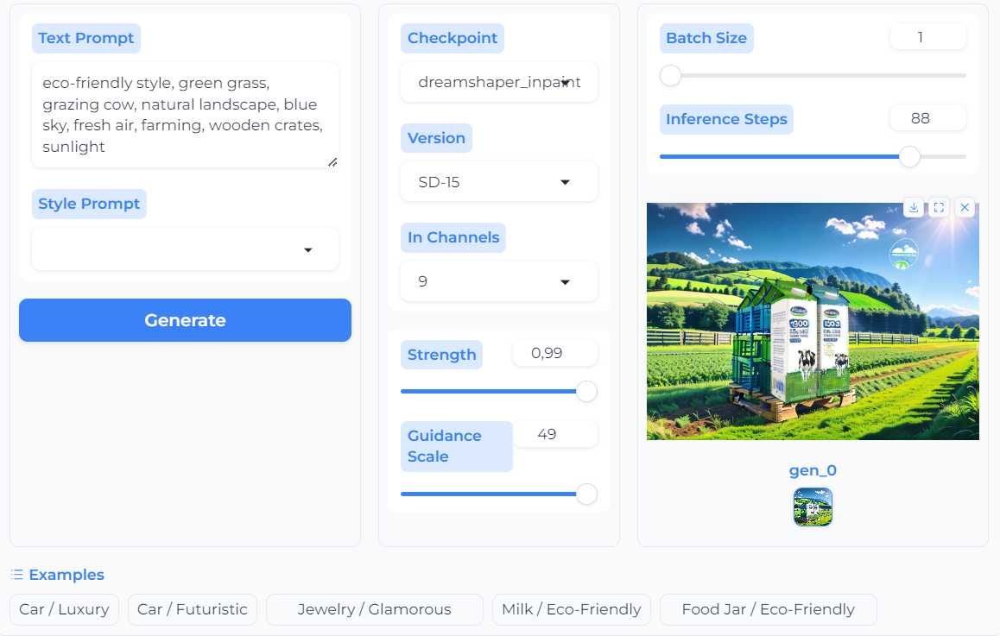
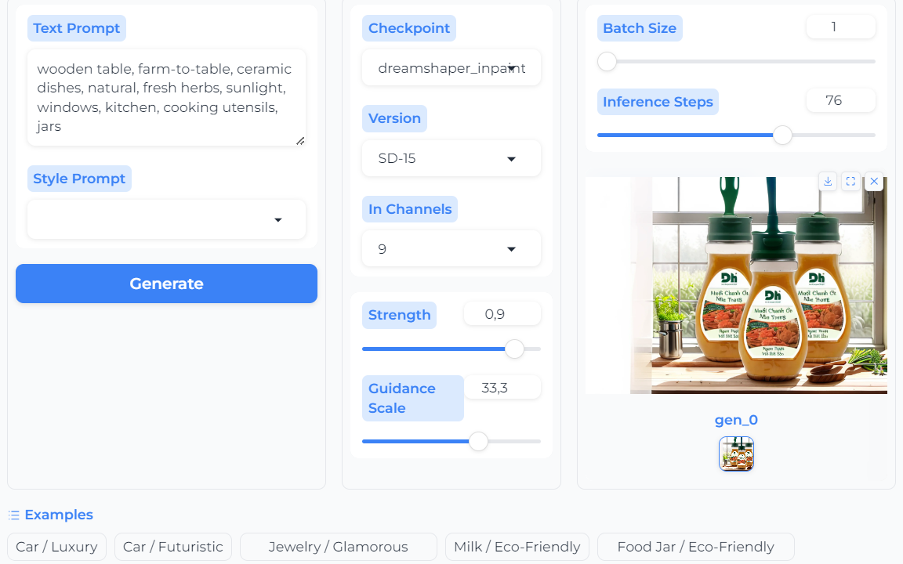
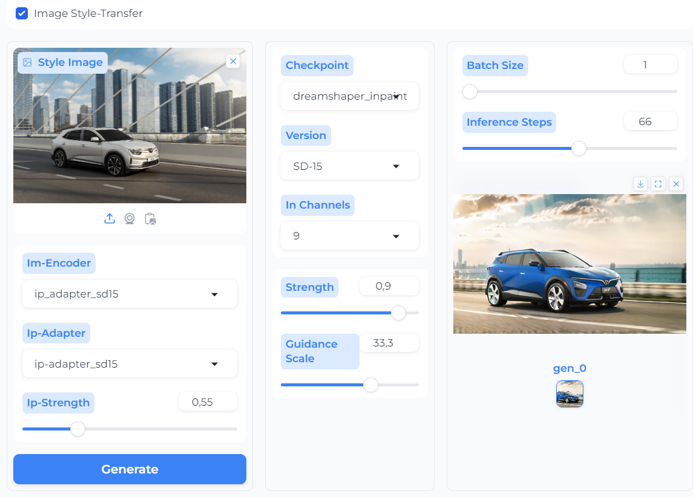

# Anilluminus.AI
[Illuminus.ai] **Multi-Modal Content Creation** for Product Marketing.

--------------------------
## To-Do List

- [x] GUI (inherited from [A1111](https://github.com/AUTOMATIC1111/stable-diffusion-webui))
- [x] **Background** Removal
- [x] **Background** Stylization
- [ ] **Animation**
- [ ] **Lighting** and **Camera** Control
- [ ] **Voiceover** / **Music**

--------------------------
## Future Improvements

- [ ] **Animate-Anything** [[notebook](https://www.kaggle.com/code/mrriandmstique/animate-anything-demo/notebook)] [[project](https://github.com/alibaba/animate-anything)]
- [ ] Video Filters & Effects

--------------------------
## Dataset

--------------------------
## Getting started

This code was tested with:

* Windows 11
* NVIDIA GeForce RTX 3060 - 6144 MiB
* Python 3.10.6
* CUDA 12.1

Setup environment (⚠️ `requirements.txt` is shared among my SD projects using **A1111** and **ComfyUI**, hence, it is not cleaned):

```shell
pip install -q -r requirements.txt
```

#### Download **Checkpoints**
- [DreamShaper v8 Inpainting](https://civitai.com/models/4384) to local folder `./checkpoints/models/dreamshaper_inpainting_v8.safetensors`

#### Add other **Checkpoints** directories
- open file `src/config.py` and add any directories into variable `sd_ckpt_dirs`

--------------------------
## User Guide

#### Run **Gradio UI**
```shell
python -m src.webui
```

#### Background Decomposition and Expansion
- User can put image with background and use this module to decompose into object and mask
- 
- Else, just insert object and background images to feed into next module
- User can expand the image to have larger canvas to fill in next module
- 

#### Background Stylization


- Tick into the Checkbox **Image Style Transfer** to switch between 2 modes below
- For each mode, there are **examples** at the bottom of the panel for user to quick test

<details>
  <summary><b>Text-Guided Generation</b></summary>

- Test case: **Car / Luxury**


- Test case: **Car / Futuristic**


- Test case: **Jewelry / Glamorous**


- Test case: **Milk / Eco-Friendly**


- Test case: **Jar / Eco-Friendly**



</details>

<details>
  <summary><b>Image-Guided Style-Transfer</b></summary>

- Test case: **Car / Luxury**


- The **IP-Adapter InstantStyle** for **SD-1.5** is not good - it is said by its author. Should be changed to **SD-XL** version, which requires more GPU again!
</details>

#### Animation 
⚠️ Not tested completely due to limitation of GPU
- Quick comparison on **Kaggle** notebooks: 
    - [AnimateDiff](https://www.kaggle.com/code/mrriandmstique/ani-mate-diff-demo): this model doesn't follow the initial image, even in examples of its owner
    - [AnimateAnything](https://www.kaggle.com/code/mrriandmstique/animate-anything-demo): this model works much better than ~~AnimateDiff~~
- Overwrite class `AnimateDiffSparseControlNetPipeline` in `diffusers` in file `./src/apps/anime/pipelines/animatediff_sparsectrl.py` to feed sub-modules (**UNet**, **Text Encoder**, **ControlNet**) to GPU only when in need. However, it runs out of my time to test.

--------------------------
## References
- `AnimateDiff` [[code](https://github.com/guoyww/AnimateDiff)]
- `SparseCtrl` [[project](https://guoyww.github.io/projects/SparseCtrl)]
- `CameraCtrl` [[code](https://github.com/hehao13/CameraCtrl)]
- `Background Removal` [[code](https://github.com/danielgatis/rembg)]
- `Segment-Anything-Model` [[code](https://github.com/continue-revolution/sd-webui-segment-anything)]
- `Instant Style-Transfer` [[code](https://github.com/instantX-research/InstantStyle)]
- `Realistic Style-Transfer` [[project](https://rongliu-leo.github.io/IPST/)] [[code](https://github.com/RongLiu-Leo/IPST)]
- `IC-Light` [[code](https://github.com/lllyasviel/IC-Light)]
- `360DVD` [[code](https://github.com/Akaneqwq/360DVD)]
- `360 Panorama` [[blog](https://virtualworlds.fun/create-360-panorama-with-stable-diffusion-and-comfyui/)]
- `SD-T2I-360PanoImage` [[code](https://github.com/ArcherFMY/SD-T2I-360PanoImage)]
- `Video Matting` [[code](https://github.com/PeterL1n/RobustVideoMatting)]
